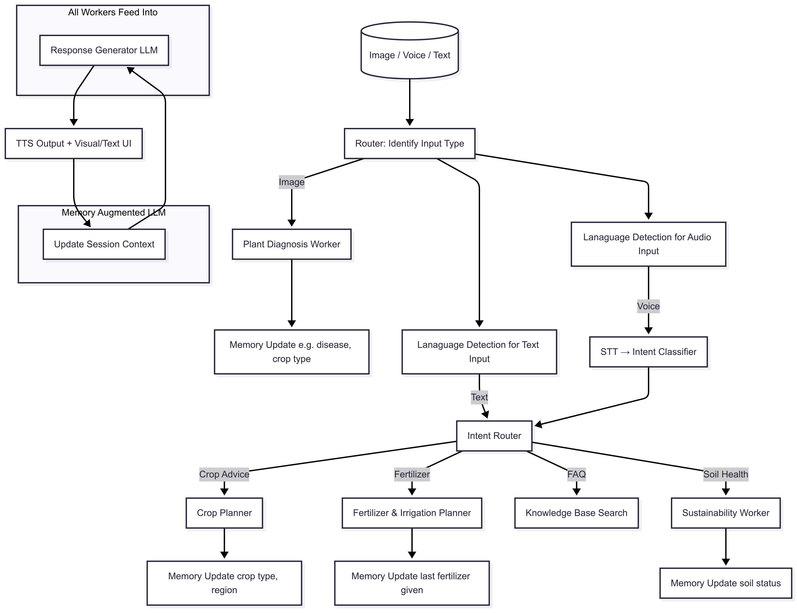

# **AgriGemma: A Multilingual, Multimodal AI Assistant for Sustainable Agriculture**

## **Project Description**

AgriGemma is a comprehensive, privacy-first agricultural AI assistant that leverages Google's Gemma 3n model to provide real-time farming advice through multiple input modalities. Built with a microservices architecture, the system processes text, voice, and image inputs to deliver personalized crop management recommendations, plant disease diagnosis, and sustainable farming guidance.

### **Core Architecture & Technical Implementation**

**Microservices Architecture:**
The system employs a robust microservices design with three primary services:

1. **Multimodal Service** (`src/services/multimodal_service/`): The core AI processing engine that handles:
   - Input routing and intent classification
   - Plant diagnosis from images using Gemma 3n vision capabilities
   - Crop planning and fertilizer recommendations
   - Soil health analysis and sustainability guidance
   - Session memory management with context-aware responses

2. **Text-to-Speech Service** (`src/services/tts_service/`): Multilingual audio output system featuring:
   - Coqui TTS with pyttsx3 fallback for 15+ languages
   - Automatic language detection and model switching
   - High-quality audio synthesis for agricultural terminology
   - Support for English, Spanish, French, German, Italian, Portuguese, Russian, Chinese, Japanese, Korean, Arabic, Hindi, Urdu, Bengali, and Punjabi

3. **Language Detection Service** (`src/services/language_detection.py`): Intelligent language processing with:
   - Text-based language detection using langdetect
   - Audio language detection using Whisper
   - Fallback mechanisms for unsupported languages
   - Real-time language switching for TTS output

**Frontend Interface** (`src/frontend/gradio_ui.py`):
- Modern Gradio-based web interface
- Multi-modal input support (text, voice, image upload)
- Real-time chat interface with audio responses
- Session management and export capabilities
- Responsive design for mobile and desktop use

### **Key Technical Features**

**Multimodal Processing Pipeline:**

**Intent Classification System:**
- **Crop Advice**: Planting guidance, pest management, growth optimization
- **Fertilizer Planning**: NPK recommendations, organic alternatives, application timing
- **Soil Health**: Soil quality assessment, improvement strategies, sustainability practices
- **FAQ System**: General agricultural knowledge and best practices

**Session Memory Management** (`src/services/multimodal_service/chat_memory.py`):
- Persistent session context across conversations
- Automatic context updates based on user interactions
- Session metadata tracking and cleanup
- Export capabilities for chat history and audio files

**RAG-Enhanced Knowledge Base:**
- Vector database for agricultural FAQ retrieval
- Cosine similarity search for relevant information
- Dynamic knowledge base updates
- Context-aware response generation

### **Gemma 3n Integration**

The system leverages Gemma 3n's unique capabilities through Ollama integration:

**Model Configuration:**
- **Model**: `gemma3n:e4b` (4B parameter variant)
- **API Endpoint**: `http://localhost:11434/api/generate`
- **Streaming**: Disabled for synchronous processing
- **Fallback**: Graceful error handling with default responses

**Multimodal Capabilities:**
- **Text Processing**: Intent classification, response generation, context building
- **Image Analysis**: Plant disease diagnosis, crop identification, field assessment
- **Audio Processing**: Speech-to-text transcription, audio-based intent classification

### **Software Engineering Excellence**

**Protocol Buffer Communication** (`protos/`):
- `multimodal.proto`: Core service communication
- `tts.proto`: Text-to-speech service interface
- `farm.proto`: Legacy agricultural service definition

**Database Layer** (`db/`):
- SQLite-based session storage
- Structured logging with metadata
- Automatic session cleanup and maintenance
- Chat history persistence and retrieval

**Testing Infrastructure** (`tests/`):
- Comprehensive unit tests for language detection
- Audio processing validation
- TTS quality assessment
- Session management testing
- Integration tests for multimodal workflows

**Deployment & Orchestration** (`scripts/`):
- `run_all_servers.py`: Automated service orchestration
- Individual service launchers for development
- Graceful shutdown handling
- Process management and monitoring

### **Privacy-First Design**

**Offline Capabilities:**
- All AI processing occurs locally using Gemma 3n
- No external API dependencies for core functionality
- Local session storage and data management
- Complete privacy preservation for sensitive agricultural data

**Data Management:**
- Session-based data isolation
- Automatic cleanup of old sessions
- Export capabilities for user data portability
- No persistent storage of sensitive information

### **Real-World Impact**

**Agricultural Applications:**
- **Crop Disease Diagnosis**: Real-time plant health assessment from field photos
- **Fertilizer Optimization**: Personalized nutrient recommendations based on crop type and region
- **Sustainable Practices**: Soil health monitoring and improvement guidance
- **Multilingual Support**: Accessibility for diverse farming communities worldwide

**Technical Innovation:**
- **Multimodal Intent Classification**: Advanced routing based on input type and content
- **Context-Aware Responses**: Memory-augmented conversations for personalized advice
- **Language-Agnostic Processing**: Seamless multilingual support without translation overhead
- **Offline-First Architecture**: Reliable operation in remote agricultural settings

This comprehensive system demonstrates the power of Gemma 3n's multimodal capabilities while addressing real-world agricultural challenges through innovative software engineering practices and user-centric design.